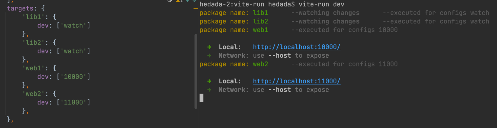

<h1 align="center">vite-run</h1>
<br/>
<p align="center">
    <a href="https://npmjs.com/package/vite-run">
        
    </a>
    <a href="https://img.shields.io/npm/l/vite-run">
      
    </a>
</p> 
<br/>


**English** | [中文](./README.zh-CN.md)

Multiple configuration execution support for vite, configuration sharing, and free combination of configurations like
building blocks,
Granularity is accurate to single field configuration    
This tool is developed in `pnpm` multi package mode


## install

- yarn

```shell
    yarn add vite-run -D
``` 

- pnpm

```shell
    pnpm add vite-run -D
``` 

## Terminal commands

-   ```shell
    vite-run [configuration name] [?appNames]...
    ```

example：

- Execute all configurations containing dev. If you do not specify an app name, by default, all configurations
  containing dev in the app will be found and executed
    ```shell
     vite-run dev
    ```
- Perform dev configuration for app and app2, with no limit on the number of app names
    ```shell
     vite-run dev app1 app2
    ```

## Simple Demonstration

The following is just a simple demonstration, not a complete configuration.  
Please refer to the complete configuration for more information [viterun.config.ts](./viterun.config.ts)

**dev**


**build**


## viterun.config [.js | .ts]

`Viterun.config`  is a configuration file created in the project root directory,
similar to `vite.config` , The suffix can be `js` or `ts`

```javascript
import { defineConfig } from "vite-run";
export default defineConfig({
  // baseConfig:{},
  // packages:[],
  // target:{},
  // other vite config block map
})
```

**baseConfig**

- desc `For shared vite configuration, all configuration blocks will be merged with it as the final configuration information`

- type `Function | object`

    ```javascript
    export default defineConfig({
       baseConfig:(options)=>{  // Using functional form, options contain subpackage information and can dynamically generate configurations
          return {
            resolve: {
              extensions: [".ts",".js",'.vue'],
              alias: {
                "@": resolve(options.packagePath, 'src'),
             }
            },
            plugins: [
             // vue()
            ]
          }
       }，
       // baseConfig：{}  Directly using object form
    })
    ```

**packages**

- desc  `The list of sub packages to be managed supports global and file paths, and global matching only supports ending with an * sign`

- struct ``` Array<string>```

    ```javascript
    export default defineConfig{{
       packages: [
         'packages/*',    
         'examples/vue3',
         './'     // Support the operation of the main package
       ]
    }}
    ```

**targets**

The configuration block can only be used here. Please refer to the terminology explanation below for the description of
the configuration block

- desc  `Define the configuration name and the [configuration block] or [configuration block group] it wants to run`
- struct ``` { appName: { scriptName :[ configName | Array<configName> ] }}```
  > For example, there are two sets of configurations in the build list in the web app below:   
  `Umd`is a configuration block that is directly merged with baseConfig to form the final configuration.  
  `['es', 'production'] ` is a configuration block group,
  After merging the combination (overlapping configurations will be dominated by later configurations) into the same
  configuration,
  Merge with baseConfig to form the final configuration.

  ```javascript
      export default defineConfig({
        targets: {
          'lib-app':{
             dev: ['watch']        
          },
          'web-app': {
             prod: [   
               ['es','production'],  // Configuration Block Group 
               'umd'   // Configuration Block 
             ],
             dev:['10000']
          },
        },
      })
      ```

**Other vite config block map**

There are differences between `vite.config` and `viterun.config` for configuring vite configurations:
`vterun`wraps an object around the original vite configuration and names each vite configuration block.
The original vite configuration serves as the value of the key name

```javascript
// vite configuration structure
export default defineConfig({
  build: {
    lib: {
       formats: ['es']
    },
    watch: {},
  },
  server: {
    port: 10000
  },
})
//--------------------------------------------
// viterun configuration structure
export default defineConfig({
  build: {
    es:{     // Supports the use of object forms
      lib:{
         formats: ['es']
       }
    },
    es:(options)=> {  // Supports functional returns, with options containing subpackage information
      return {
        lib: {
          formats: ['es']
        }
      }
    },
    watch: {
      watch:{}
    },
  },
  server: {
    10000: {
      port: 10000
    },
  },
})


```


## viteRunLogPlugin

If you need to control and optimize console output information, viterun has a `built-in` `viteRunLogPlugin` plugin
This plugin can control the default log output of vite and the log output of viterun tool
You can directly import and use it. Please click on the editor link to view the configuration and usage information in
the d. ts file yourself

```javascript
import { viteRunLogPlugin } from 'vite-run'
```

## interceptStdoutWriteLog

If you have a need to intercept other log outputs, you can use the `interceptStdoutWriteLog` function,
This plugin can control and `intercept all` character stream information output to the console

```javascript
import { interceptStdoutWriteLog } from 'vite-run'
interceptStdoutWriteLog((log)=>{
    console.warn(log)  // If console. log cannot be used, please use console. warn
    //Returning true indicates that the log is output, while returning false indicates that the log is not output,
    //If you want to modify the log, simply return false and manually output it from console. warn
    return true 
})
```


## Terminology

1. `configuration block`: For example, in the following configuration, `es` is the name of the configuration block,
   The value corresponding to es is the `build` object originally configured by vite,
   Configuration blocks, also known as vite configuration blocks,
   refer to a small part of the vite configuration and are named for easy combination and configuration in the future

   ```javascript
   export default defineConfig({
     build: {
       es: {
         lib: {
           formats: ['umd']
         },
       }
     }
   })
   ```
2. `configuration name`: For example, `dev` below is the configuration name, which contains multiple vite configuration blocks,
   Each array member (configuration block | configuration block group) in the dev array will ultimately generate an independent vite configuration
   ```javascript
   export default defineConfig({
      targets: {
        'lib-app':{
           dev: [
             'watch'，
             'es'
           ]        
        },
      }
    })
   ```
## License  

MIT License.
