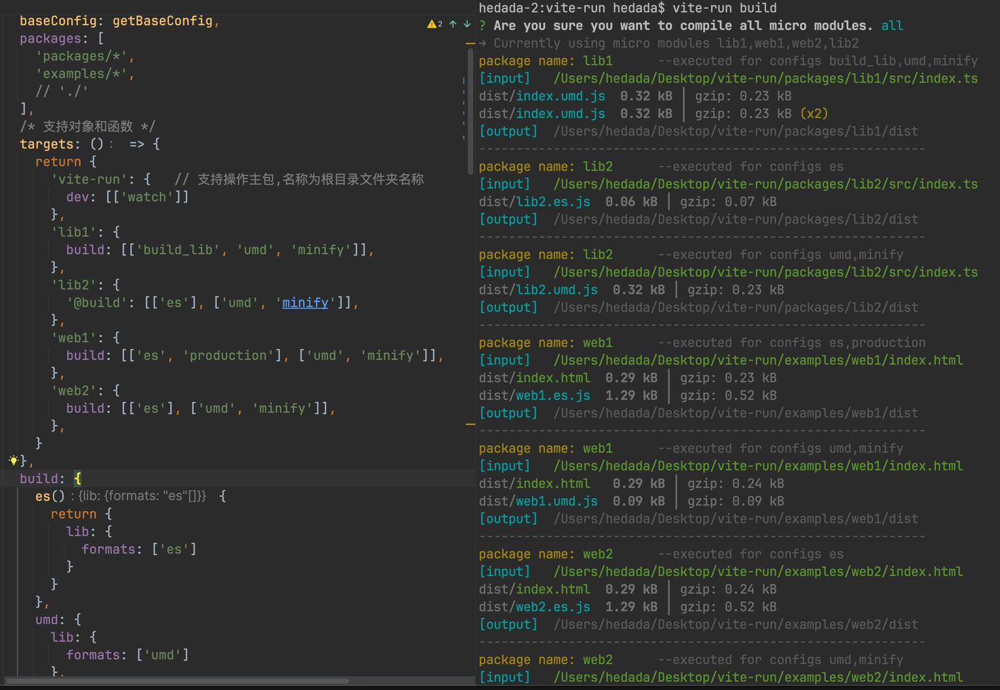

<h1 align="center">vite-run</h1>
<br/>
<p align="center">
    <a href="https://npmjs.com/package/vite-run">
        
    </a>
    <a href="https://img.shields.io/npm/l/vite-run">
      
    </a>
</p> 
<br/>


**中文** | [English](./README.md)

vite 多配置执行支持, 配置共享，像搭积木一样自由组合配置，
颗粒度精确到单字段配置。  
它可以完全替代`vite.config`,您无需在每个包中都创建一个`vite.config`配置  
该工具在`pnpm` 多包模式下开发


## install

- yarn

```shell
    yarn add vite-run -D
``` 

- pnpm

```shell
    pnpm add vite-run -D
``` 

## Terminal commands

-   ```shell
    vite-run [配置名称] [?appNames]...
    ```

例如：

- 执行全部包含dev的配置，不指定app名称则默认找到所有app中包含dev的配置并执行
    ```shell
     vite-run dev
    ```
- 为 app 和 app2 执行dev配置, app名称没有限制个数
    ```shell
     vite-run dev app1 app2
    ```

## Simple Demonstration

下方只是简单演示示例，并非完整配置，
完整配置请见[viterun.config.ts](./viterun.config.ts)

**dev**


**build**


## viterun.config [.js | .ts]

`viterun.config`是在项目根目录下创建的配置文件，类似`vite.config`,
后缀可以是`js`或者`ts`

```javascript
import { defineConfig } from "vite-run";
export default defineConfig({
  // baseConfig:{},
  // packages:[],
  // target:{},
  // other vite config block map
})
```

**baseConfig**

- desc  `用于共享的vite配置，所有的配置块都会和其合并作为最终配置信息`
- type `Function | object`

    ```javascript
    export default defineConfig({
       baseConfig:(options)=>{  // 使用函数形式，options包含子包信息，可以动态生成配置
          return {
            resolve: {
              extensions: [".ts",".js",'.vue'],
              alias: {
                "@": resolve(options.packagePath, 'src'),
             }
            },
            plugins: [
             // vue()
            ]
          }
       }，
       // baseConfig：{}  直接使用对象形式
    })
    ```

**packages**

- desc  `要进行管理的子包列表，支持glob与文件路径，glob匹配只支持末尾带*号`
- struct ``` Array<string>```

    ```javascript
    export default defineConfig{{
       packages: [
         'packages/*',    
         'examples/vue3',
         './'     //  支持操作主包
       ]
    }}
    ```

**targets** `[ 配置块只能在这里使用, 配置块说明请看下方术语解释 ]`

- desc  `定义配置名和其要运行的[配置块]或者[配置块组]`
- struct ``` { appName: { scriptName :[ configName | Array<configName> ] }}```
  > 比如下方web-app中的 build 列表中存在两组配置：
  `umd` 是一个配置块，直接和baseConfig合并成最终配置。   
  `['es','production']`是一个配置块组，
  会先将该组合并(配置重叠会以后面配置为主)成同一个配置之后，
  再和baseConfig合并成最终配置。

  ```javascript
      export default defineConfig({
        targets: {
          'lib-app':{
             dev: ['watch']        
          },
          'web-app': {
             prod: [   
               ['es','production'],  // 配置块组 
               'umd'   // 配置块
             ],
             dev:['10000']
          },
        },
      })
      ```

**Other vite config block map**

`vite.config` 和 `viterun.config`针对配置vite配置是存在区别的 :  
`viterun`在原本vite的 配置上`使用一个对象包裹`起来，为每个vite配置块`命名`，
原本的vite配置则作为该键名的值

```javascript
// vite 配置结构
export default defineConfig({
  build: {
    lib: {
       formats: ['es']
    },
    watch: {},
  },
  server: {
    port: 10000
  },
})
//--------------------------------------------
// viterun 配置结构
export default defineConfig({
  build: {
    es:{     // 支持使用对象形式
      lib:{
         formats: ['es']
       }
    },
    es:(options)=> {  // 支持函数形式返回，options包含子包信息
      return {
        lib: {
          formats: ['es']
        }
      }
    },
    watch: {
      watch:{}
    },
  },
  server: {
    10000: {
      port: 10000
    },
  },
})


```


## viteRunLogPlugin

您如果需要管控和优化控制台输出信息，viterun`内置`了一个`viteRunLogPlugin`插件
该插件能控制vite默认日志输出 和 viterun工具的日志输出   
您可以直接导入使用，配置和使用信息请自行点击编辑器链接到d.ts文件中查看

```javascript
import { viteRunLogPlugin } from 'vite-run'
```

## interceptStdoutWriteLog

如果您有拦截其他日志输出的需求，你可以使用`interceptStdoutWriteLog`函数,  
该插件能控制和拦截`所有`输出到控制台的字符串流信息

```javascript
import { interceptStdoutWriteLog } from 'vite-run'
interceptStdoutWriteLog((log)=>{
    console.warn(log)  // 如果console.log用不了，请使用console.warn
    // 返回 true 表示输出该日志，返回false表示不输出该日志，
    // 如果想修改日志，直接返回false，然后console.warn手动输出就行
    return true 
})
```


## 术语解释

1. `配置块`： 比如下面配置中 `es` 就是配置块名称，
   es对应的值便是原本vite配置的`build`对象，  
   配置块也可以叫做vite配置块，指的就是vite配置中的一小部分，并为其取名方便后面自由组合配置
    ```javascript
    export default defineConfig({
      build: {
        es: {
          lib: {
            formats: ['umd']
          },
        }
      }
    })
    ```
2. `配置名称`： 比如下方的`dev`就是配置名称，里面包含多个vite配置块，
   dev数组里面每个数组成员(配置块 | 配置块组)最终都会生成一个独立的vite配置
   ```javascript
   export default defineConfig({
      targets: {
        'lib-app':{
           dev: [
             'watch'，
             'es'
           ]        
        },
      }
    })
   ```

## 许可证

MIT 许可证.
